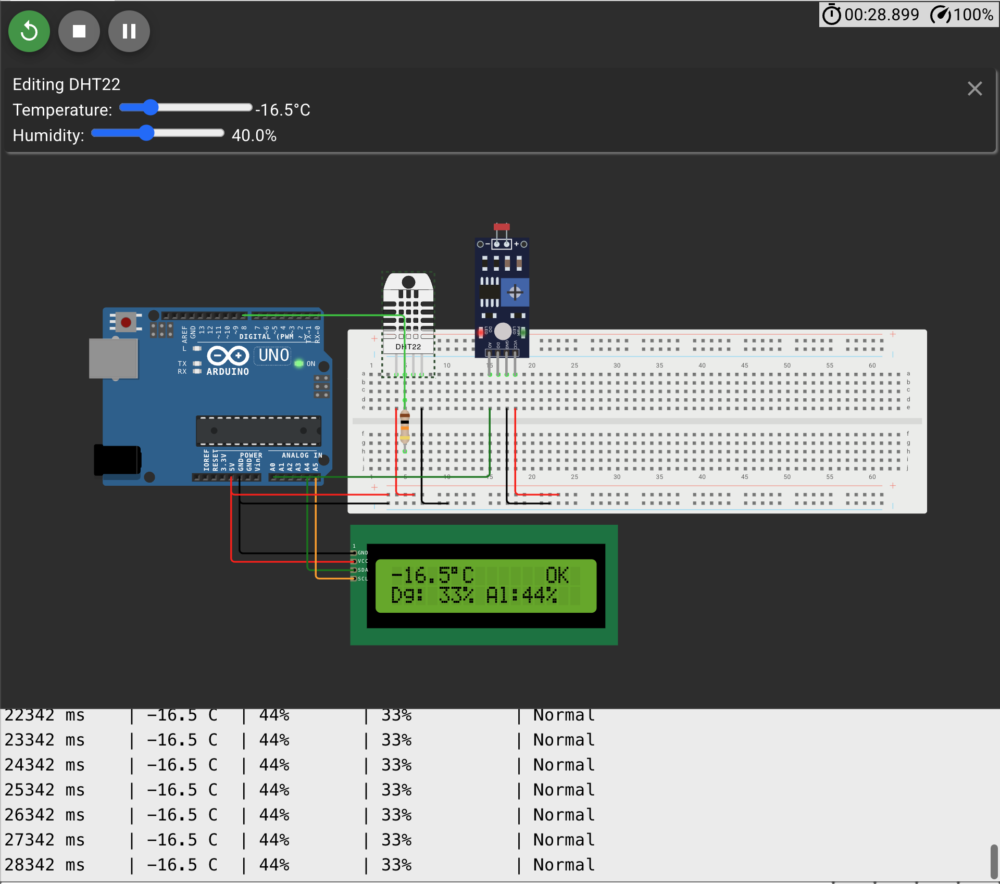

# IceTrack

A IceTrack é uma plataforma de monitoramento do degelo glacial que combina dados satelitais públicos com sensores físicos de campo para rastrear, analisar e projetar a retração das geleiras ao longo do tempo. A solução consome dados tabulares do NSIDC — registros mensais de extensão de gelo marinho disponíveis desde 1979, derivados de satélites e os processa para gerar visualizações históricas, cálculo de tendência por modelagem exponencial e projeções de impacto no nível dos oceanos.

## Estação de Monitoramento Polar

A entrega de **Edge Computing & Computer Systems** simula uma estação de campo polar, complementando dados orbitais (satélites NASA/ESA/INPE) com medições locais de temperatura e albedo em tempo real.

## O Problema

Desde 1979, a extensão do gelo ártico diminuiu em média **13% por década** (NSIDC). O derretimento das calotas polares eleva o nível dos oceanos, afetando centenas de milhões de pessoas em regiões costeiras. Monitorar esse processo exige dados orbitais de larga escala **e** medições locais de campo — este protótipo representa a segunda camada.

## Arquitetura

| Fonte                              | Tipo de dado                 |
| ---------------------------------- | ---------------------------- |
| Satélites                          | dados orbitais               |
| **Estação Arduino (esta entrega)** | dados de campo em tempo real |

Ambas as fontes alimentam o **Backend em Python**, que processa e entrega os dados ao usuário.

## Componentes

| Componente       | Pino          | Função                                         |
| ---------------- | ------------- | ---------------------------------------------- |
| DHT22            | D8            | Temperatura superficial do gelo (°C)           |
| Fotoresistor LDR | A0            | Albedo simulado — reflectividade da superfície |
| LCD I2C 16x2     | SDA=A4/SCL=A5 | Exibição dos dados em tempo real               |
| LED built-in     | D13           | Alerta visual de degelo ativo                  |

## Lógica dos Sensores

### Temperatura (DHT22)

- Abaixo de -10°C: superfície estável
- Entre -10°C e -2°C: zona de atenção
- Acima de -2°C: limiar crítico, degelo ativo — LED acende (referência: IPCC AR6, Cap. 9)

### Albedo (LDR)

Simula um piranômetro de reflexão. Fórmula aplicada:

```
albedo(%) = 30 + (leitura_LDR / 1023) x 60
```

Referência (NSIDC / IPCC AR6): neve fresca ~90%, gelo antigo ~50-60%, gelo sujo ~30%, água exposta ~6%.

### Índice de Degelo (Dg)

Interpolação linear entre os extremos da faixa polar:

```
temp <= -30°C  ->  Dg = 0%
temp >=  10°C  ->  Dg = 100%
caso contrário ->  Dg = (temp + 30) / 40 x 100
```

- 0-20%: gelo estável
- 21-50%: aquecimento moderado
- 51-80%: degelo significativo
- 81-100%: fusão acelerada, situação crítica

### Ciclo Ice-Albedo Feedback

Gelo derrete → expõe água escura → albedo cai → superfície absorve mais calor → temperatura sobe → mais gelo derrete.
Uma queda progressiva no albedo, mesmo sem aumento de temperatura, é sinal precoce de degradação glacial.

### Display LCD

```
Linha 0:  [sinal][temp]°C    [status]
Linha 1:  Dg:[x]%  Al:[x]%

Normal:   -16.5°C          OK      /  Dg:11%  Al:67%
Alerta:    +2.3°C       ALERT      /  Dg:80%  Al:38%
```

### Monitor Serial

```
Timestamp(ms) | Temp(C) | Albedo(%) | IDegelo(%) | Alerta
1000 ms       | -16.5 C |       67% |        11% | Normal
3000 ms       |  +2.3 C |       38% |        80% | *** ALERTA ***
```

---

## Estrutura do Circuito



O circuito é montado em protoboard conectada ao Arduino UNO:

- **DHT22** ligado ao pino D8 (VCC → 5V, GND → GND, DATA → D8 com resistor pull-up de 10kΩ)
- **LDR** ligado ao pino A0 em divisor de tensão com resistor de 10kΩ para GND
- **LCD I2C 16x2** ligado ao barramento I2C (SDA → A4, SCL → A5, VCC → 5V, GND → GND)
- **LED built-in** do Arduino UNO (pino D13) — sem componente externo necessário

## Simulação

Protótipo desenvolvido e validado no **Wokwi**.

[clique aqui para acessar a simulação](https://wokwi.com/projects/465099232719792129)

### Passo a passo para executar

1. Acesse o link da simulação acima.
2. Clique no botão **▶ Start Simulation** (canto superior esquerdo).
3. O LCD exibirá a tela de inicialização **"IceTrack v1.0 / Iniciando..."** por 2 segundos e depois entrará em operação.
4. Abra o **Serial Monitor** (ícone de terminal na barra inferior do Wokwi) para ver os dados tabulados em tempo real.
5. **Testar alerta de degelo:** clique sobre o componente DHT22 no circuito → ajuste o slider de **Temperature** para um valor acima de **-2°C** → o LED vermelho começará a piscar e o LCD mostrará `ALERT`.
6. **Testar albedo:** clique sobre o **LDR** no circuito → ajuste o slider de intensidade de luz → o valor `Al:%` na linha 2 do LCD será atualizado.
7. Para retornar à condição estável, ajuste a temperatura do DHT22 para abaixo de **-2°C** → o LED apaga e o LCD volta a exibir `OK`.

## Estrutura do Repositório

```
icetrack-edge/
├── icetrack.cpp   — código principal Arduino
└── README.md      — este arquivo
```

## Referências

- NSIDC: https://nsidc.org/data/g02135
- IPCC AR6 (2021), Chapter 9: Ocean, Cryosphere and Sea Level Change
- NASA Earthdata — MODIS Snow and Ice Products: https://earthdata.nasa.gov
- ESA Copernicus — Sentinel-2 Surface Reflectance: https://browser.dataspace.copernicus.eu

## Integrantes

| Nome                           | RM       |
| ------------------------------ | -------- |
| Artur Fabi Brandi              | RM570258 |
| Victor Bertacchini De Godoy    | RM571452 |
| Victor Lula Heineken Rodrigues | RM570782 |
